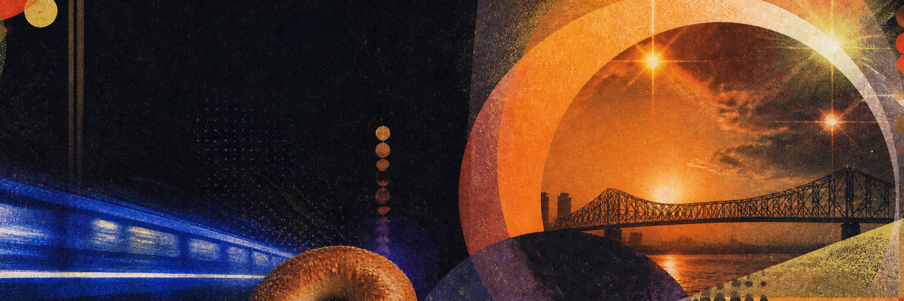

 

# ANTONIO SPIEZIA

**founding GTM · ex-IB · operator · community guy**

 

  

 

> **I like the part before the obvious thing.** 
> The half-formed idea, the first customer conversation, the room that needs to exist before anyone knows to ask for it.

 

<table>
<tr>
<td width="50%" valign="top">

## CURRENT ROTATION

**[OpenMTL](https://luma.com/openmtl)** 
**[Hilt](https://hilt.ai/)** 
**[trails](https://trails.legal/)** 
**[BagelHacks](https://www.instagram.com/antoniospiezia/)** 
**[Cursor MTL](https://x.com/antoniospiezia)**

</td>
<td width="50%" valign="top">

## SIGNAL HIGHLIGHTS

 
 
 

</td>
</tr>
</table>

 

<b>Reading / eating / thinking about</b>

 

**Reading:** [The Creative Act](https://www.amazon.ca/dp/0593652886) · [The Infinity Machine](https://www.amazon.com/Infinity-Machine-Hassabis-DeepMind-Superintelligence/dp/0593831845) · [Manias, Panics, and Crashes](https://www.amazon.ca/Manias-Panics-Crashes-History-Financial/dp/1137525754)

**Montréal food map:** [Damas](https://www.damas.ca/) · [Moccione](https://moccione.com/) · [Sumac](https://sumacrestaurant.com/) · [Olimpico](https://cafeolimpico.com/)

**Default mode:** curious, direct, slightly over-caffeinated.

 

Made with intent from Montréal · © 2026 Antonio Spiezia

