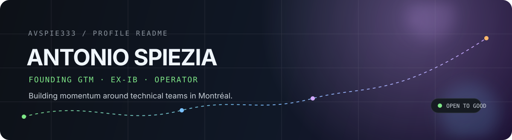

<div align="center">



<br />

<a href="https://antoniospiezia.com"></a>
<a href="https://x.com/antonio_spie"></a>
<a href="https://www.linkedin.com/in/antoniovspiezia/"></a>
<a href="mailto:me@antoniospiezia.com"></a>

</div>

<br />

## The short version

I build the go-to-market layer around ambitious technical teams.

Right now, I’m a **Founding GTM member at [Hilt](https://hilt.ai/)**, focused on real-time data access governance. Before that, I co-founded [trails](https://trails.legal/) and helped grow it from assistant → legal research → AI-native law firm.

I’m based in **Montréal, Québec** — usually somewhere between a builder meetup, a gym, and a very opinionated meal.

<br />

<table>
<tr>
<td width="33%" valign="top">

### NOW

**Hilt**<br />
Founding GTM · data access governance

**OpenMTL**<br />
Founders, engineers & curious people building in Montréal

</td>
<td width="33%" valign="top">

### BEFORE

**trails**<br />
Co-founder & CEO · AI-native legal work

**Finance**<br />
TD Asset Management · BNP Paribas · National Bank

</td>
<td width="33%" valign="top">

### AROUND HERE

**BagelHacks**<br />
Hackathons, Montréal-style

**Cursor MTL**<br />
Cafés and meetups for Cursor builders

</td>
</tr>
</table>

<br />

## My operating system

```text
  notice the signal  →  get close to users  →  make the thing real
          ↑                                      ↓
       stay curious  ←  build the community  ←  ship the loop
```

I’m most energized by the messy middle: finding the wedge, translating technical ideas into momentum, and getting the right people in a room together.

<br />

## Selected threads

| thread | what it looks like |
| :--- | :--- |
| **GTM × technical products** | Positioning, early pipeline, customer conversations, and the systems that make all three compound. |
| **Communities that ship** | OpenMTL, BagelHacks, Cursor MTL, and a Montréal builder network with 300+ people. |
| **Finance → tech** | A decade of pattern recognition from banking and asset management, now applied to startups and AI. |
| **Small bets, consistently** | Writing, shipping, training, reading, and finding the next excellent place to eat. |

<br />

## Signal, not vanity metrics

<div align="center">


</div>

<br />

## Find me in the wild

<div align="center">

**[OpenMTL](https://luma.com/openmtl)** · **[Hilt](https://hilt.ai/)** · **[trails](https://trails.legal/)** · **[BagelHacks](https://www.instagram.com/antoniospiezia/)** · **[Cursor MTL](https://x.com/antonio_spie)**

</div>

<br />

<details>
<summary><b>Currently reading / eating / thinking about</b></summary>

<br />

**Reading:** [The Creative Act](https://www.amazon.ca/dp/0593652886) · [The Infinity Machine](https://www.amazon.com/Infinity-Machine-Hassabis-DeepMind-Superintelligence/dp/0593831845) · [Manias, Panics, and Crashes](https://www.amazon.ca/Manias-Panics-Crashes-History-Financial/dp/1137525754)

**Montreal food map:** [Damas](https://www.damas.ca/) · [Moccione](https://moccione.com/) · [Sumac](https://sumacrestaurant.com/) · [Olimpico](https://cafeolimpico.com/)

**Default mode:** curious, direct, slightly over-caffeinated.

</details>

<br />

<div align="center">

<sub>Made with intent from Montréal · © 2026 Antonio Spiezia</sub>

</div>
